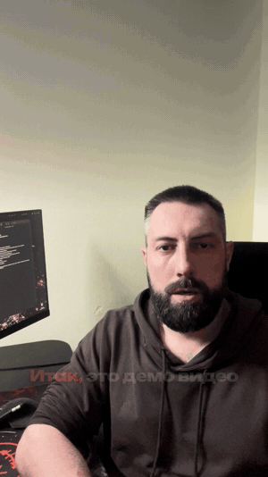
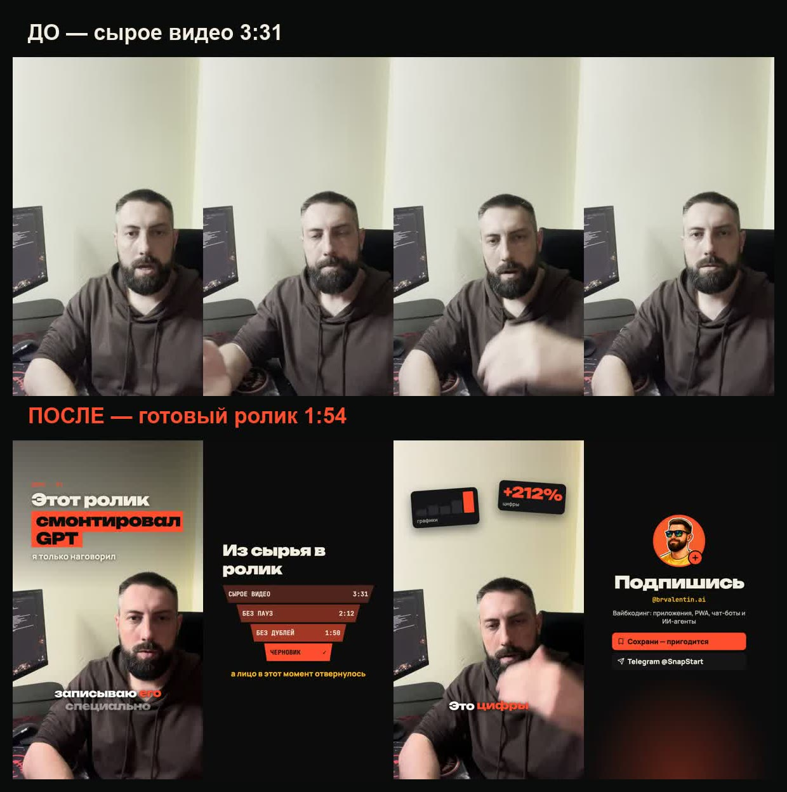
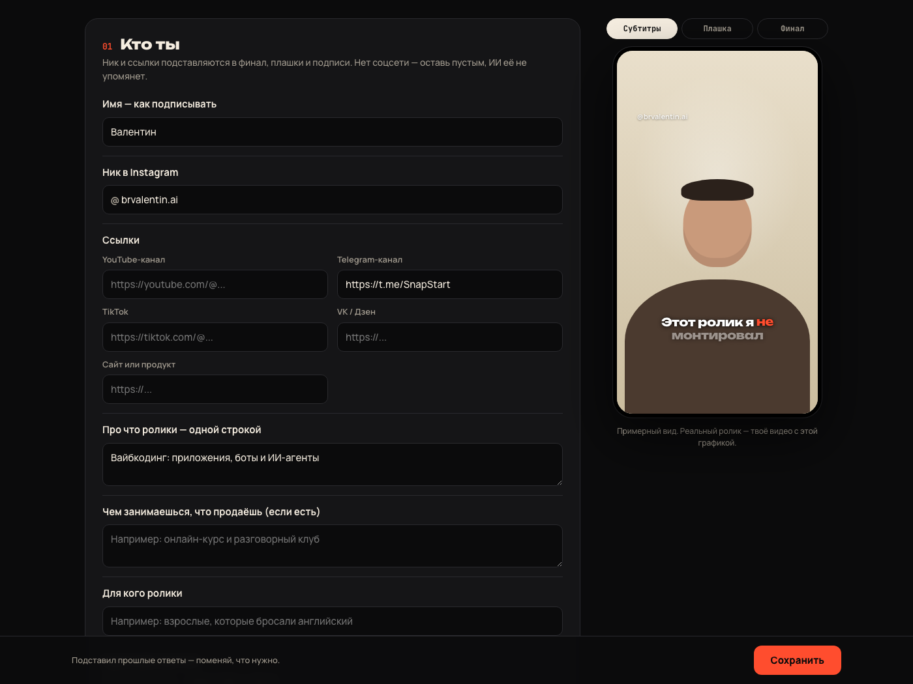
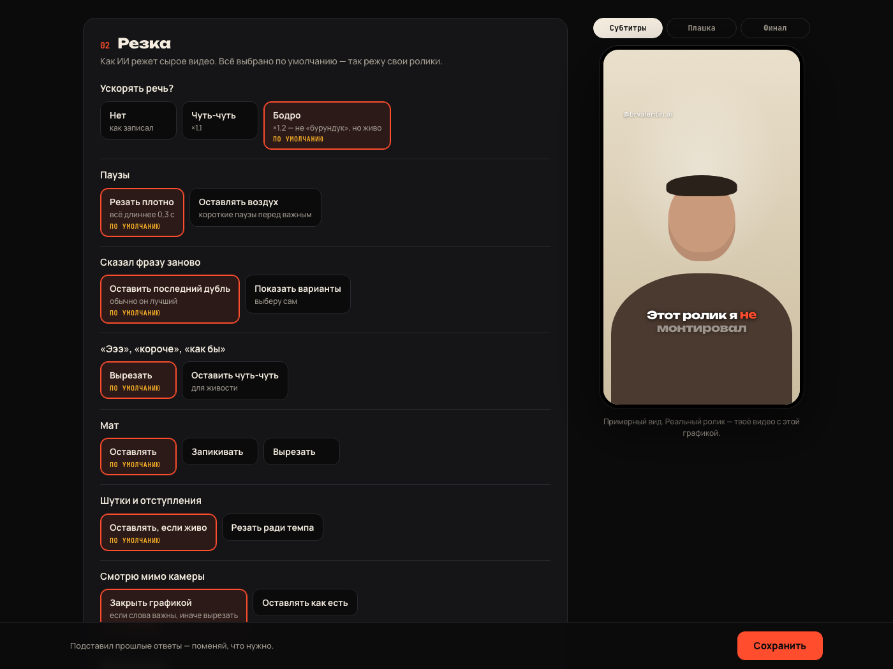
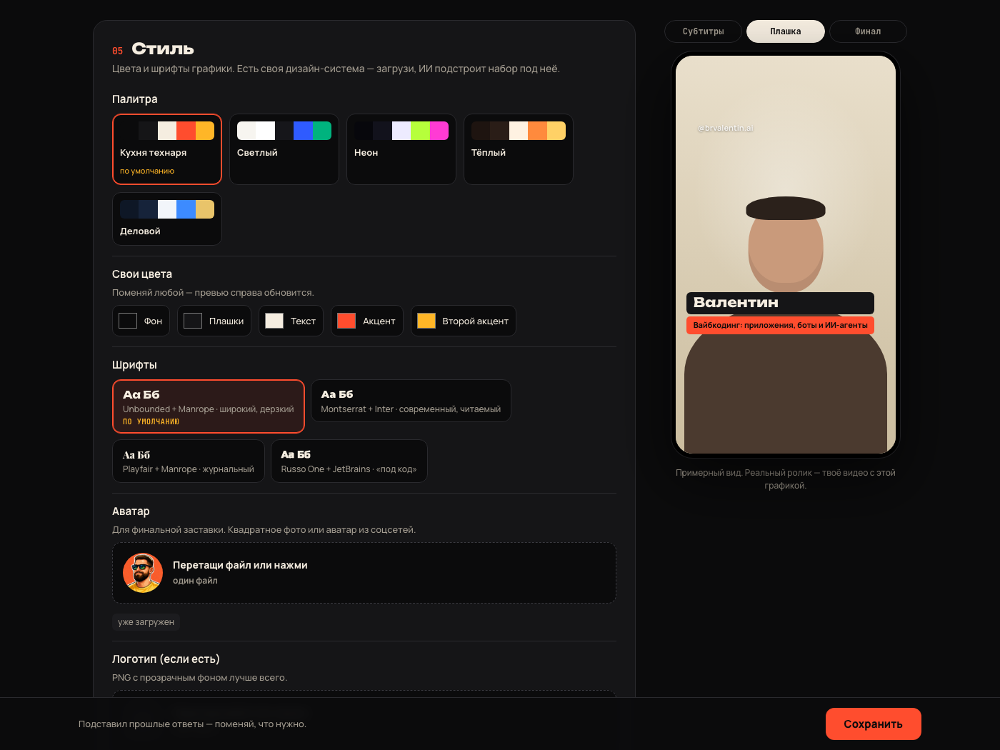
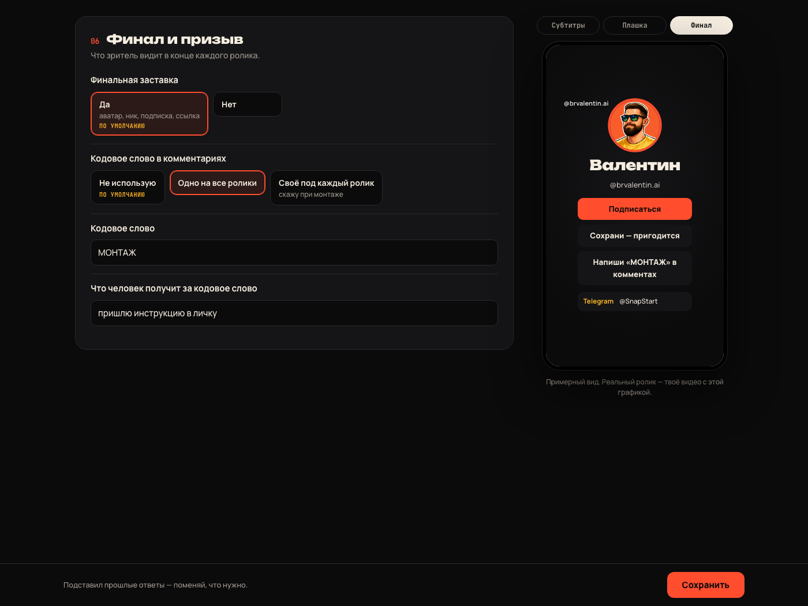
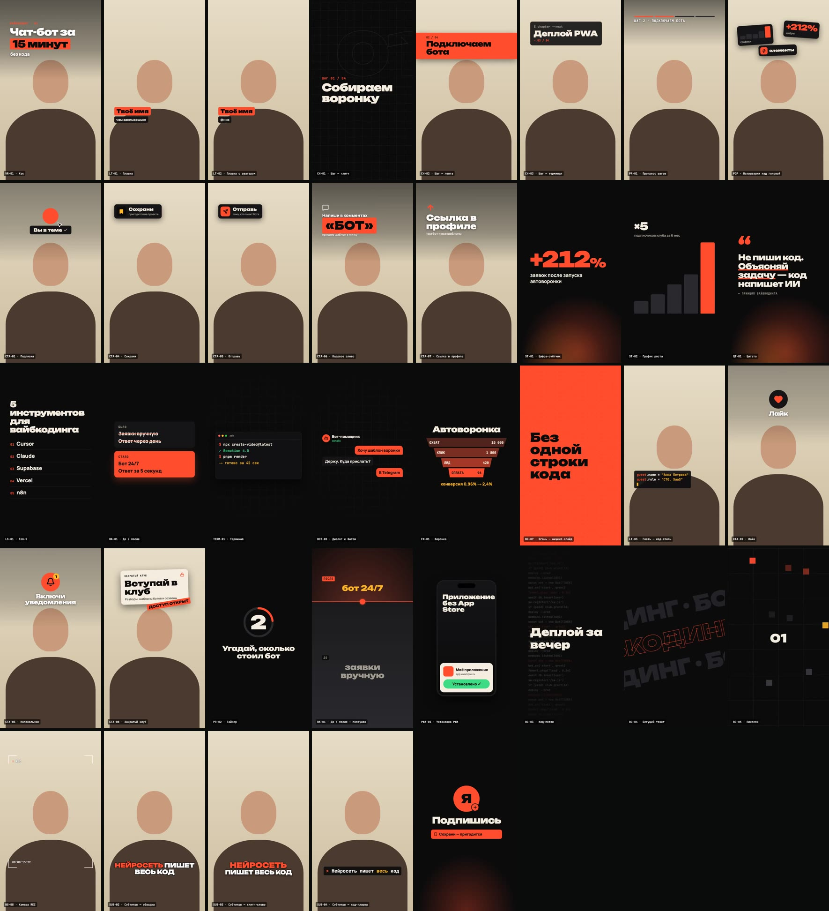
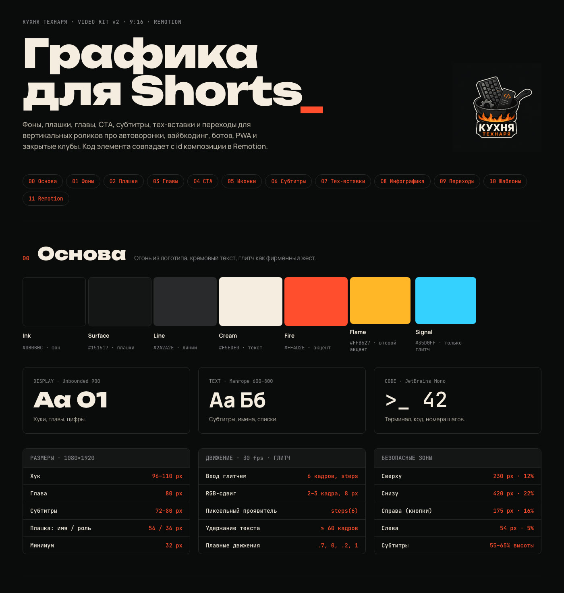
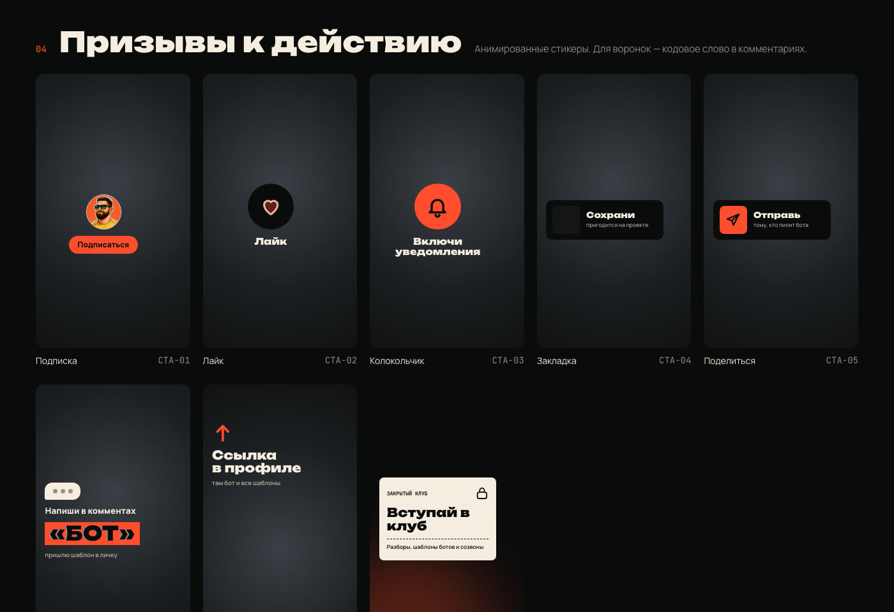
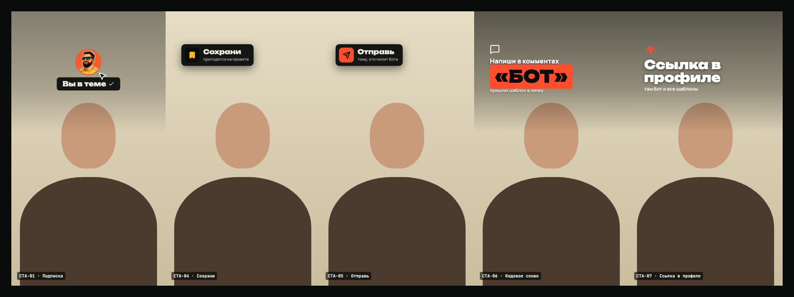

# EasyReels — монтаж Reels и Shorts с ИИ-агентом

Кидаешь сырое видео «говорящая голова» — получаешь смонтированный вертикальный ролик: без пауз и неудачных дублей, с субтитрами по словам, графикой в твоём стиле и финальной заставкой.

Работает в **Codex** (ChatGPT) и **Claude Code**. Промпты писать не нужно — только короткие фразы: «начни», «черновик», «ок».

<p align="center"></p>



Сверху — сырая запись, снизу — то же место в готовом ролике: хук над головой, полноэкранная сцена там, где автор отвернулся, всплывашки ровно на словах «графики, цифры», финальная заставка с ником и Telegram. Паузы и три перезахода вырезаны сами.

---

## Быстрый старт — три шага

**1. Скачай и открой.** Зелёная кнопка **Code → Download ZIP**, распакуй (или `git clone https://github.com/valedol190387/EasyReels`). Открой папку в Codex или Claude Code как проект. Режим — с доступом к файлам и сети: агенту нужно поставить программы.

**2. Напиши «начни».** Агент сам:
- поставит всё нужное (5–15 минут, один раз);
- откроет в браузере **анкету** — ник, ссылки, как резать, какие субтитры, цвета, аватар. Не знаешь, что выбрать, — оставь как есть: везде стоят варианты по умолчанию, проверенные на роликах. Справа — живое превью на телефоне;
- перенесёт ответы в оформление и проверит, как выглядит графика.

<table>
<tr><td></td><td></td></tr>
<tr><td align="center">Ник и ссылки — подставятся в финал и подписи</td><td align="center">Как резать: ускорение, паузы, дубли, мат</td></tr>
<tr><td></td><td></td></tr>
<tr><td align="center">Палитра и шрифты — превью меняется сразу</td><td align="center">Финальная заставка и кодовое слово</td></tr>
</table>

Ответы сохраняются в `profile.json` и больше никогда не спрашиваются: агент берёт оттуда ник, ссылки, кодовое слово и стиль для каждого ролика.

**3. Кинь сырое видео в папку `inbox` и напиши «черновик».** Через несколько минут в `drafts/` будет черновик: чистая резка + субтитры + финальная заставка. Правки — по таймкодам: «7–9 с вырежи», «на 15 с верни фразу про цены». Нравится — пиши **«ок»**: агент покажет раскадровку графики, после твоего «ок» соберёт финал в `final/`.

---

## Что происходит под капотом

Это не «промпт, который красиво монтирует». Это готовый, отлаженный на реальных роликах код — агент его запускает и принимает решения, где ИИ действительно нужен.

| Шаг | Что делает | Почему так |
|---|---|---|
| Расшифровка | Видео режется на фразы по настоящим паузам в звуке, каждая фраза расшифровывается отдельно (whisper, на твоём компьютере) | На длинном файле время слов у whisper к концу уезжает на секунды — резать по нему нельзя |
| План резки | Агент читает текст и решает, что оставить: последний удачный дубль, без «эээ», воды и оборванных мыслей | Это смысловое решение — его и делает ИИ |
| Резка | Границы прилипают к тишине (слова не рубятся), звук чистится и выравнивается под соцсети (−14 LUFS), речь ускоряется (по анкете) | Самая частая ошибка автонарезок — слово пополам |
| Поворот головы | Детектор лица находит, где ты смотришь мимо камеры; агент проверяет кадры глазами | Отвернулся на склейке — выглядит как брак; такие места закрываются графикой |
| Дубли | Каждая фраза сверяется с соседней: «начал — сбился — начал заново» | Whisper склеивает заход и перезаход в одну фразу |
| Субтитры | По словам, текущее слово подсвечено, 1–2 строки, ниже лица | Читаются с выключенным звуком |
| Монтаж | Раскадровка на согласование → хук, полноэкранные сцены, всплывашки, зумы, мемы, звуки | Графика ставится только на утверждённую резку |
| Финал | Рендер в полном качестве, проверка кадров и поворотов по готовому файлу | Агент сам отсматривает результат до слова «готово» |

## Графика

Набор по умолчанию — **«Кухня Технаря · Video Kit v2»**: хуки, плашки, главы-шаги, призывы (подписка, сохрани, отправь, кодовое слово, ссылка в профиле), счётчики, графики, цитаты, списки, «было / стало», терминал, диалог с ботом, воронка, всплывашки над головой, финальная заставка. Цвета и шрифты — из анкеты.



### Из Claude Design — в код

Набор нарисован в **Claude Design** как дизайн-система: палитра, шрифты, размеры, безопасные зоны Instagram, движение — и каждый элемент с кодом (`CTA-06`, `ST-01`…).



Дальше она перенесена в Remotion один в один — те же элементы, только теперь это код, который рендерится поверх твоего видео:

| В Claude Design | В ролике (Remotion) |
|---|---|
|  |  |

**Своя дизайн-система.** Сделай свою в Claude Design (или Figma, или просто брендбук) и загрузи в анкете. Агент возьмёт оттуда цвета и шрифты и перекрасит весь набор — сами элементы не переписываются, поэтому качество не падает.

## Медиатека

Звуки и мемы с описаниями («что в кадре», теги) скачиваются при установке — агент подбирает вставку по смыслу фразы. Свои файлы просто кидай в `public/library/memes`, `sfx`, `music` — агент допишет их в каталог.

Музыки в наборе нет: чужой трек Instagram может заглушить, YouTube — снять. Хочешь музыку — клади свою в `public/library/music` и выбери это в анкете (на свой страх и риск) или добавляй трек в приложении при публикации.

## Фразы для агента

| Пишешь | Что будет |
|---|---|
| «начни» | установка + анкета + оформление |
| «черновик» | резка + субтитры из видео в `inbox/` |
| «7–9 с вырежи», «верни фразу про …» | правка черновика |
| «ок» | раскадровка графики → после «ок» финал |
| «анкета» / «поменяй ник, цвета» | анкета ещё раз |
| «запомни: всегда …» | агент допишет твоё правило в `AGENTS.md` и будет его соблюдать |

## Что нужно

- macOS или Linux. Windows — через WSL (Ubuntu).
- ~3 ГБ места, интернет на время установки.
- Подписка на Codex (ChatGPT) или Claude Code. Всё остальное бесплатно: расшифровка речи работает локально, без ключей и API.
- На Mac — [Homebrew](https://brew.sh). Если его нет, агент подскажет одну команду.

## Честно об ограничениях

- **Графика — крепкая база, а не магия.** Агент расставляет элементы по правилам, но вкус — твой: поэтому раскадровка всегда идёт тебе на согласование до рендера.
- **Первый ролик — дольше** (агент ставит программы и качает модель речи ~1,6 ГБ). Дальше черновик — несколько минут.
- **Формат — говорящая голова**, вертикально. Скринкасты и интервью — не основной сценарий.
- Codex и Claude используют один и тот же код, но решения (какой элемент где) у моделей могут немного отличаться.

## Структура

```
AGENTS.md          правила для агента (CLAUDE.md ссылается на него)
.agents/skills/    скиллы: reels-start, reels-draft, reels-montage (для Claude — .claude/skills, та же папка)
setup/             установка и анкета
tools/             инструменты: transcribe, cut, gaze, dupcheck, words, preview, final, library, brand
src/kit/           набор графики (Remotion)
src/reels/         монтаж твоих роликов (шаблон — _template)
inbox/ drafts/ final/   сырьё → черновики → готовое
```

Под капотом: [Remotion](https://www.remotion.dev) (видео как код), [whisper.cpp](https://github.com/ggml-org/whisper.cpp), ffmpeg, MediaPipe.
Remotion бесплатен для частных лиц и небольших команд — условия для компаний смотри в [их лицензии](https://www.remotion.dev/license).

---

Лицензия — [MIT](LICENSE). Сделал [Валентин Брюханцев](https://instagram.com/brvalentin.ai) — Telegram [«Кухня технаря»](https://t.me/SnapStart): вайбкодинг, боты, PWA и то, как ИИ забирает рутину.
